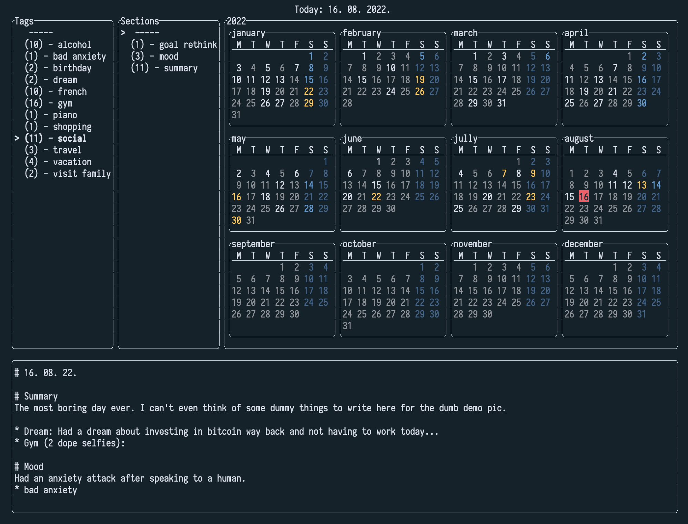

# Captain's Log - or `clog` for short
`clog` is a small terminal based journaling tool. 



## What it does
Daily entires are saved locally as markdown files. Level 1 headers are interpreted as 'sections' and unordered lists
starting with '*' character are interpreted as 'tags'. Titles of those two are then shown in two menus, selecting 
an item in that menu, highlights the dates with mentions of that tag/title in the calendar. This is a nice way
to visualise how (in)consistent your habits & activities are.

Clicking on a date or pressing enter when a date is focused will (maybe) open that log file in an editor.
Currently clog uses your `$EDITOR` environment variable to start the editor, if that environment variable is set. Otherwise
this functionality is disabled. This looks pretty cool with terminal based editors.

## Keybindings 
- `hjkl` or arrow keys = for navigating within calendar or menus
- `tab` or `shift + tab` =  switch focus between calendar and menus
- `enter` = highlight logs that contain tag/section or open log entry in `$EDITOR` for date under the cursor
- `d` - delete

## Log entry tags and sections
`clog` stores all logs as simple markdown files purely to give your editor some syntax highlighting when editing. 
This 'syntax' was chosen with little thought based on personal preference. If you find flaws, do open an issue.
It is up to you to choose what would be a section and what would be a tag.

*Sections*

To mark a section just do: `# section name`. All text below until the next section is considered part of it, although 
clog currently does not care about that text, just the section title. By default, the first line of the file is ignored when
looking up section titles, as I like to use that line for a section with the date of the current line, this is configurable via 
command line arguments or config file.

*Tags*

The tags do not apply to a specific section but to the whole log entry file. 
- `* tag name`
- `* tag name (some other optional info)`
- `* tag name (some other optional info): a multiline body that is ignored by clog`
For examples of valid and invalid sections and tags see [./test/log_entry_test.cpp](./test/log_entry_test.cpp)

## Configuration & command line options
Currently clog silently ignores unknown options or bad arguments, so watch out. This will probably be changed in the future.

*Command line options*
```
clog (Captains Log)
A small TUI journaling tool.

 -h --help                     - show this message
 -c --config <path>            - override the default config file path (~/.clog/config.ini)
 --log-dir-path <path>         - path where log files are stored (default: ~/.clog/day/)
 --log-name-format <format>    - format in which log entry markdown files are saved (default: d%Y_%m_%d.md)
 --sunday-start                - have the calendar display sunday as first day of the week)"};
 --first-line-section          - if a section mark is placed on the first line, 
                                 by default it is ignored as it's left for log title, this overrides this behaviour
```

*Config file*

Here is an example with all supported options:
```
log-dir-path = /path/to/log/dir
log-name-format = %Y_%d_%m.txt
sunday-start = true
first-line-section = true
```

## Building & installing
**Dependencies**

`clog` fetches it's dependencies from github, except from boost, you should have boost program options installed.


To build the `clog` executable, run:
```sh
mkdir build && cd build && cmake ..
make 
```
After a successful build, to install the executable where it most likely will be visible with your current `$PATH` Run: `sudo make install`.
Then you can just run the app by typing `clog` in your terminal.

If you want to build and run the tests do:
```sh
mkdir build && cd build && cmake .. -DBUILD_TESTS=ON
make 
ctest
```

## Planned work
- [ ] emojis? unicode support ok? need to switch to wstring?
- [ ] feat: add ability to toggle tags from clog directly instead of opening the editor
- [ ] feat: displaying different years than current is not fully functional
- [ ] feat: repeat events: forgettable things like birthdays and anniversaries are highlighted if user wants to do so.

lower priority work:
- [ ] feat: shift + J/K skip whole month
- [ ] feat: preview window focuses parts of the text that matches tag or task selected
- [ ] feat: scrollable preview window
- [ ] fix: mouse wont focus unfocused menus
